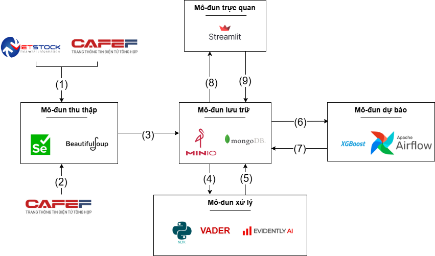

# Thiết kế kiến trúc

**Hình: Kiến trúc hệ thống**

Kiến trúc hệ thống bao gồm các mô-đun thu thập, lưu trữ, xử lý, dự báo và trực quan-đánh giá dữ liệu. Các thành phần và luồng dữ liệu được mô tả trong hình trên.

---

**Luồng dữ liệu (1)**:  
Dữ liệu về cân đối kế toán được lấy từ VietStock và CafeF bằng công cụ Selenium. Bên cạnh đó, dữ liệu giá chứng khoán, khối lượng giao dịch,... cũng được thu thập từ CafeF bằng Selenium.

**Luồng dữ liệu (2)**:  
Tin tức tài chính của các mã cổ phiếu được thu thập tại CafeF sử dụng thư viện BeautifulSoup.

**Luồng dữ liệu (3)**:  
Dữ liệu thu thập và log quá trình được đưa vào mô-đun lưu trữ. Dữ liệu từ (1) được lưu vào **MinIO** – hệ thống lưu trữ mở rộng. Dữ liệu từ (2) được lưu vào **MongoDB**.

**Luồng dữ liệu (4 - 5)**:  
- Dữ liệu tài chính được xử lý (so sánh, chuyển đổi).
- Dữ liệu tin tức được xử lý ngôn ngữ tự nhiên bằng `newspaper3k` và tính điểm cảm xúc bằng **VADER Sentiment**.  
- Dữ liệu sau xử lý được tích hợp và lưu lại lên MinIO.

**Luồng dữ liệu (6 - 7)**:  
- Mô-đun dự báo sử dụng mô hình **XGBoost Regressor** để dự đoán giá đóng cửa.  
- Kết quả dự báo, độ quan trọng đặc trưng được lưu vào MinIO.  
- Mô hình được lập lịch tự động với **Airflow** để tái huấn luyện theo đánh giá đầu ra.

**Luồng dữ liệu (8 - 9)**:  
- Mô-đun trực quan hoá cho phép giám sát quá trình qua log, kết quả và biểu đồ bằng **Streamlit**.  
- Người dùng có thể cập nhật thông tin mới và hệ thống sẽ đánh giá điểm cảm xúc và cập nhật dữ liệu.
- Hệ thống hỗ trợ so sánh sai lệch phân phối giữa tập dữ liệu mới và hiện có bằng **Evidently**, xuất báo cáo `.html` lưu vào MinIO.  
- Kết quả của Evidently là điều kiện để kích hoạt tái huấn luyện mô hình.

---

## Kết quả 

### Xử lý dữ liệu từ nhiều nguồn

#### Vấn đề
Dữ liệu mô tả báo cáo tài chính từ nhiều nguồn có thể khác nhau về định dạng, về tính đầy đủ. Trường hợp nếu ta chỉ dùng dữ liệu từ một nguồn duy nhất sẽ khó đảm bảo được tính đầy đủ dữ liệu cho mục tiêu mong muốn. Mặt khác, nếu ta sử dụng dữ liệu từ cả 2 nguồn thì ta phải có phương án tích hợp.

#### Giải pháp
Hệ thống cung cấp thao tác xử lý so sánh dữ liệu từ hai nguồn với tập đặc trưng định nghĩa sẵn có từ hệ thống. Sau khi so sánh xong, tùy thuộc vào độ tính tin cậy, tính đầy đủ của nguồn thu thập mà ta có thể điều chỉnh cách thức chọn ra dữ liệu cuối cùng.

#### Kết quả
Cách thức xử lý này có thể mở rộng bằng việc thu thập dữ liệu từ nhiều nguồn hơn như TCBS,... Ý nghĩa của giải pháp là làm cho hệ thống có dữ liệu đầy đủ nhất phục vụ cho việc phân tích và dự báo chính xác hơn.

### Lưu trữ với MinIO thay vì HDFS

#### Vấn đề
Ban đầu hệ thống lưu trữ được lựa chọn là HDFS, nhưng đầu ra quá trình thu thập là các tệp ứng với từng mã (có hơn 1600 mã) nhưng kích thước nhỏ (từ 6KB-30KB). Khi sử dụng HDFS để lưu trữ số lượng lớn các tệp nhỏ, hệ thống gặp phải nhiều vấn đề như gánh nặng metadata trên NameNode.

#### Giải pháp
Hệ thống lưu trữ với MinIO được thay thế. Dữ liệu được lưu trữ trong bucket mà không cần ánh xạ block nên sẽ giảm thiểu lãng phí dung lượng lưu trữ và tốc độ truy xuất dữ liệu tốt hơn so với cơ chế block của HDFS.

### Kiểm soát đầu ra hệ thống

#### Vấn đề
Trong từng quy trình của hệ thống, sẽ có những kịch bản không mong muốn: dữ liệu cần quan tâm không có, dữ liệu không đạt yêu cầu nhất định,...

#### Giải pháp
Hệ thống cung cấp các tệp log theo dõi các quá trình quan trọng như thu thập, xử lý và tích hợp dữ liệu, phân tích kết quả dự đoán. Mỗi bước có thể kiểm tra kết quả hoạt động của bước trước đó để phân tích nguyên nhân và xử lý kịp thời.

#### Kết quả
Giải pháp giúp người dùng đảm bảo đầu ra từng bước trong quy trình, tăng cường tính giám sát và chất lượng hệ thống.

### Kiểm tra hiệu quả của Evidently

#### Vấn đề
Để minh họa việc sai lệch phân phối giữa hai tập dữ liệu, cần dữ liệu sai lệch và tiền xử lý đồng nhất, nhưng dữ liệu hiện tại còn ít cập nhật.

#### Giải pháp
Giả lập một bộ dữ liệu nhỏ với 20 mã đầy đủ đặc trưng để giảm thời gian phân tích (từ 60 phút xuống còn 2 phút). Áp dụng trên đặc trưng số và dùng chung hàm tiền xử lý cho cả hai bộ dữ liệu.

#### Kết quả
Cung cấp kinh nghiệm kiểm thử với dữ liệu lớn bằng bộ dữ liệu nhỏ và xử lý đầu vào đồng nhất.

## Kết luận

Hệ thống dự báo giá cổ phiếu thử nghiệm thành công với các thành phần hoàn chỉnh, cung cấp luồng thu thập, lưu trữ, xử lý, dự báo và trực quan hóa dữ liệu. Mô hình dự báo XGBoost được huấn luyện và cập nhật tự động qua Airflow. Sử dụng MongoDB, MinIO thay cho HDFS giúp tối ưu lưu trữ và truy xuất dữ liệu lớn. Điểm cảm xúc từ tin tức được tính bằng VADER và tích hợp với dữ liệu tài chính giúp cải thiện độ chính xác mô hình. Hệ thống có tính năng so sánh dữ liệu từ nhiều nguồn và tự động đánh giá chất lượng dữ liệu bằng Evidently. Dashboard Streamlit giúp người dùng dễ dàng theo dõi và cập nhật thông tin thị trường.

## Hạn chế

- Một số mã không thể thu thập hoàn toàn do kết nối và timeout.
- Dữ liệu thu thập mất gần 2 ngày cho toàn bộ dữ liệu.
- VADER dùng tiếng Anh không chính xác hoàn toàn cho tiếng Việt. Thay vì sử dụng kết quả từ VADER thì nên sử dụng đặc trưng thô khi xử lý text làm các đặc trưng đầu vào để mô hình học.
- Evidently xử lý chậm với dữ liệu lớn (50-60 phút).
- Cần xử lý đồng nhất đặc trưng đầu vào để so sánh.
- Phải can thiệp thủ công để giám sát lỗi khi dùng Airflow.

